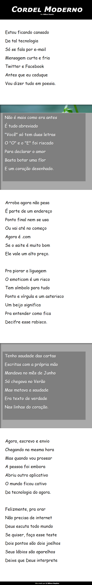

# Projeto Cordel  

>Projeto do Curso em Vídeo do Professor Guanabara  

[Clique aqui para acessar](https://naqleto.github.io/projeto-cordel/) 

## Tecnologias  

- HTML5
- CSS3
- Git 
- Github  

## O que aprendi  
- Trabalhar com imagens;  
- Efeito Parallax;  
- Deixar o site responsivo;  

## Contato 

naqleto@gmail.com
